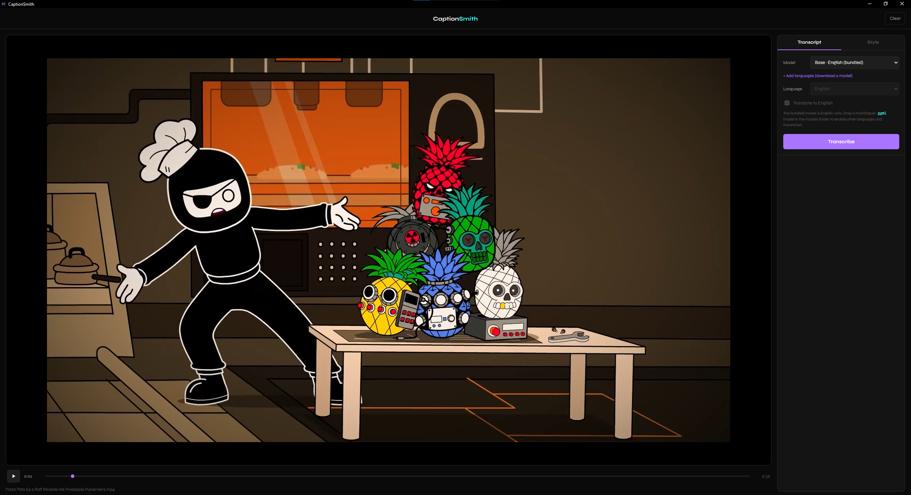
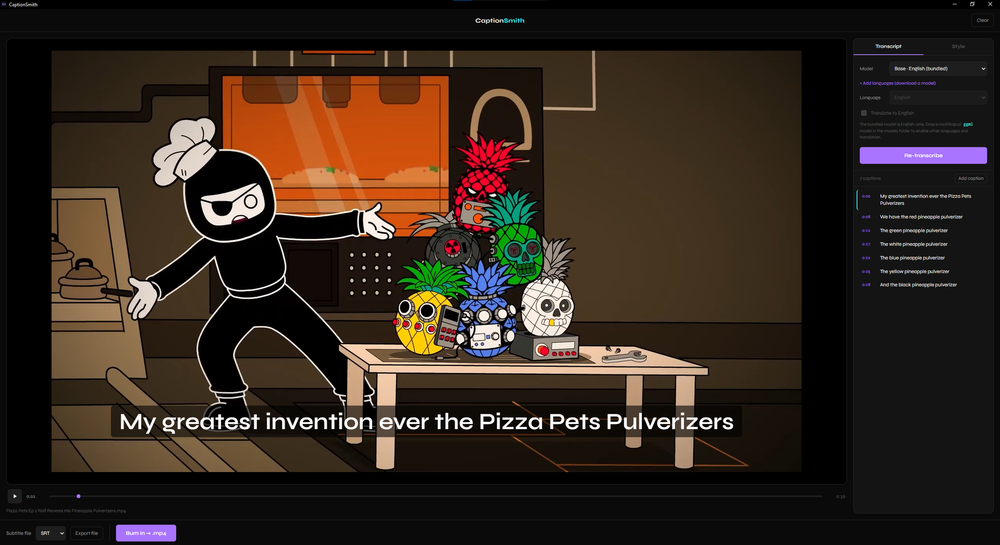
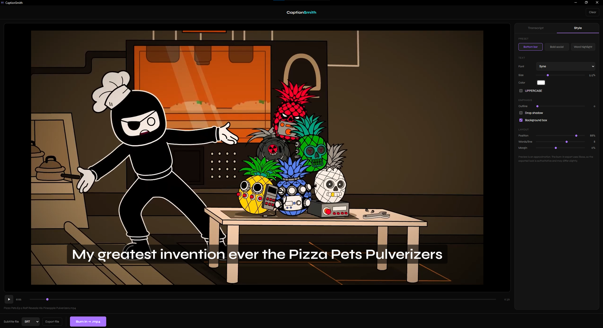

<p align="center">
  
</p>

<h1 align="center">CaptionSmith</h1>

<p align="center">Add captions to any video — transcribed on your own machine.</p>

<p align="center">
  <a href="https://github.com/ccharafeddine/CaptionSmith/releases">
    
  </a>
  <a href="https://github.com/ccharafeddine/CaptionSmith/actions/workflows/ci.yml">
    
  </a>
  <a href="LICENSE">
    
  </a>
  
</p>

<p align="center">
  
  
  
  
</p>

<p align="center">
  <code>captions</code> · <code>subtitles</code> · <code>whisper</code> · <code>speech-to-text</code> ·
  <code>transcription</code> · <code>on-device</code> · <code>local-first</code> · <code>privacy</code> ·
  <code>diarization</code> · <code>ffmpeg</code> · <code>tauri</code> · <code>solidjs</code> · <code>rust</code>
</p>

---

CaptionSmith is a small, fast desktop app for Mac and Windows. Open a local video
(or paste a URL — YouTube and other sites work), and CaptionSmith transcribes the
audio, shows you an editable transcript, lets you style the captions, and exports
either a video with the captions **burned in** or a subtitle **sidecar file**.

The transcription runs **entirely on your machine** with
[whisper.cpp](https://github.com/ggerganov/whisper.cpp) — your audio is never
uploaded anywhere. It's local-first: no accounts, no media library, no telemetry,
no ads. A local video is read in place and never imported or copied. The only
feature that touches the network is URL import (which downloads the video to a
temp file, deleted when you quit) and a one-time model download if you swap in a
larger model.

Built with [Tauri](https://v2.tauri.app) and [SolidJS](https://www.solidjs.com),
with a bundled build of [whisper.cpp](https://github.com/ggerganov/whisper.cpp)
for on-device transcription and a bundled GPL build of
[FFmpeg](https://ffmpeg.org) (including `libx264` and `libass`) for audio
extraction and the caption burn-in.

<p align="center"><b>Load a video</b><br />
  
</p>

<p align="center"><b>Transcribe on-device, then edit the transcript</b><br />
  
</p>

<p align="center"><b>Style the captions over a live preview</b><br />
  
</p>

## How captions work

CaptionSmith extracts the audio, runs it through a local Whisper model, and gives
you back an editable transcript with timestamps. From there you can export two
ways:

- **Burned in.** The captions are rendered onto the video and it's re-encoded to
  an **H.264 / AAC `.mp4`** (`libx264`, CRF 18, visually near-lossless). This is
  what you want for social — the captions are visible everywhere, including the
  muted autoplay feeds where most short-form video is watched. Because it
  re-encodes, it isn't instant and isn't bit-identical to the source; a progress
  bar shows while it works.
- **Sidecar file.** Export a `.srt`, `.vtt`, or `.ass` subtitle file with no
  re-encode. Handy for handing off to a video editor or uploading to platforms
  (like YouTube) that accept subtitle files. Note that most social platforms
  don't render an uploaded subtitle track — for those, use burn-in.

Transcription runs on the CPU and stays on your machine. A longer video takes
longer; a progress bar and a Cancel button show while it runs.

## Features

- Open `mp4`, `mov`, `mkv`, `webm`, `avi`, `m4v` via file picker or drag-and-drop
- **Import from a URL** — paste a YouTube (or other site) link and CaptionSmith
  fetches the video with a bundled [yt-dlp](https://github.com/yt-dlp/yt-dlp),
  with a progress bar and Cancel while it downloads
- **On-device transcription** with whisper.cpp — audio never leaves your machine.
  Ships with an English model, and a built-in **model manager** downloads
  multilingual models (one model covers ~99 languages) for auto language
  detection and **translate-to-English**
- **GPU acceleration** where available — Metal on Apple Silicon, Vulkan on
  Windows — with automatic CPU fallback and an on/off toggle in Settings. Speeds
  up the larger models most
- An **editable transcript** synced to the video: fix words, merge/split
  segments, nudge timing, click a line to jump to it, and **insert a caption**
  for non-speech lines like `[laughs]`
- **Bring your own transcript** — import an existing `.srt` or `.vtt` file to
  style and burn in, skipping transcription entirely
- **Batch captioning** — queue several videos and caption them all in one pass
  with your chosen style, exporting sidecars or burned-in MP4s to a folder
- **Speaker labels** — on-device diarization ("who spoke when") tags each caption
  with a speaker you can rename and reassign, then optionally prefix ("Alice: …")
  or color captions per speaker. Models download on first use; audio stays local
- **Caption styles** — six presets (bottom bar, bold social, clean top, neon,
  word highlight, karaoke pop) with controls for font, size, color, outline,
  position, and words-per-line, over a live preview. The **karaoke** styles pop
  the active word as it's spoken, with a choice of **per-word emphasis**: recolor,
  grow, or underline
- **Burn-in export** to H.264/AAC `.mp4` with a real progress bar, **or** a
  **sidecar** `.srt` / `.vtt` / `.ass`
- Exports default to an **Exports folder** (`<Documents>/CaptionSmith/Exports`),
  created on first export — the save dialog opens there with the name prefilled,
  and you can still save anywhere
- **Clear** the loaded video without opening another
- Dark, minimal interface (follows your system's light/dark setting)
- Native binaries for macOS and Windows

## Keyboard shortcuts

| Key | Action |
|---|---|
| `Space` | Play / pause |
| `←` / `→` | Step one frame |
| `Enter` | Edit the caption at the playhead |
| `Esc` | Cancel export / close a dialog |

## Install

Download the latest installer from the
[Releases](https://github.com/ccharafeddine/CaptionSmith/releases) page:

- **Windows**: the `.msi`. Windows SmartScreen may warn on an unsigned app;
  choose **More info → Run anyway**.
- **macOS**: the `.dmg` (one universal build runs on both Apple Silicon and
  Intel). The app is unsigned, so the first launch needs the Gatekeeper
  workaround:

  > **Right-click** (or Control-click) the app in Applications → **Open** →
  > **Open** again in the dialog. You only need to do this once.

## Build from source

Prerequisites: [Node.js](https://nodejs.org) 20+ and the
[Rust toolchain](https://rustup.rs).

```bash
npm install

# Provide the bundled FFmpeg/ffprobe sidecars (GPL, with libx264 + libass),
# placed in src-tauri/binaries with the per-target-triple names Tauri expects.
bash scripts/fetch-ffmpeg.sh        # Windows: BtbN GPL static build
bash scripts/build-ffmpeg-macos.sh  # macOS: compile GPL FFmpeg from source
                                    # (needs Xcode CLT + `brew install nasm`)

# Build the whisper.cpp sidecar and download the default model.
bash scripts/fetch-whisper.sh       # builds whisper-cli via CMake, fetches
                                    # ggml-base.en.bin

# Provide the bundled yt-dlp sidecar for URL import (refresh before each release;
# yt-dlp goes stale as sites change their players).
bash scripts/fetch-ytdlp.sh

# Run in development
npm run tauri dev

# Produce a production build for the current platform
npm run tauri build
```

On macOS there's no suitable static GPL FFmpeg, so the sidecars are compiled from
source with `--enable-gpl --enable-libx264`; on a Mac, `bash scripts/fetch-ffmpeg.sh`
delegates to the build script for you. CI builds both platforms on a tag push
(see `.github/workflows/release.yml`).

## Bundled binaries & licensing

CaptionSmith is **GPL-3.0** licensed. The caption burn-in re-encodes with
`libx264`, which is GPL; combining it makes the whole app GPL (the standard
situation for open-source video tools like HandBrake, Shotcut, and OBS). The
transcription side is permissively licensed — the GPL comes only from the burn-in
re-encoder. The binaries are invoked as separate sidecar processes:

- **whisper.cpp** (MIT), on-device transcription. Built from source in CI. Source:
  <https://github.com/ggerganov/whisper.cpp>.
- **Whisper model** `ggml-base.en.bin` (MIT), bundled default; you can supply a
  larger or multilingual model in `<AppData>/CaptionSmith/models`.
- **FFmpeg** (GPL, with `libx264` and `libass`), used for audio extraction and the
  caption burn-in. Windows uses the GPL static build from
  [BtbN/FFmpeg-Builds](https://github.com/BtbN/FFmpeg-Builds); macOS is compiled
  from the official [FFmpeg](https://ffmpeg.org/download.html) source. Source:
  <https://ffmpeg.org/download.html>.
- **yt-dlp** (Unlicense / public domain), used only for URL import. Refreshed per
  release via `scripts/fetch-ytdlp.sh`. Source:
  <https://github.com/yt-dlp/yt-dlp>.
- **Font**: Syne (SIL Open Font License), bundled in `src/assets/fonts` with its
  license file. No web-font requests are made.

## Release notes

### v2.0.0

A major update that lands the entire post-v1 roadmap — still 100% on-device, still
no accounts and no cloud. Everything below runs on your own machine.

- **Settings panel** (gearwheel, top-right): prompt-only update check (never a
  silent install), Whisper model management, GPU toggle, and theme — all
  on-device, never any cloud or API keys.
- **In-app model manager** — download multilingual Whisper models (one model
  covers ~99 languages) for automatic language detection and
  **translate-to-English**.
- **GPU-accelerated transcription** — **Metal** on Apple Silicon and **Vulkan** on
  Windows, with automatic CPU fallback and an on/off toggle. Speeds up the larger
  models most.
- **Bring your own transcript** — import an existing `.srt` or `.vtt` file to
  style and burn in, skipping transcription entirely.
- **More caption styles** — six presets (bottom bar, bold social, clean top, neon,
  word highlight, karaoke pop) plus **per-word emphasis** (recolor, grow, or
  underline) for the karaoke styles.
- **Batch captioning** — queue several videos and caption them all in one pass,
  exporting sidecars or burned-in MP4s to a folder.
- **Speaker labels** — on-device diarization ("who spoke when") tags each caption
  with a speaker you can rename and reassign, then optionally prefix ("Alice: …")
  or color captions per speaker. Diarization models download on first use; audio
  never leaves the machine.
- **Insert captions** for non-speech lines like `[laughs]`.
- **Fix** — captions now render spaces between words correctly in the live preview.

### v1.0.1

- macOS is now a **universal** build — runs natively on both Apple Silicon and
  Intel.
- Fixed macOS caption burn-in: the bundled FFmpeg is fully self-contained (no
  hidden Homebrew dependencies), so burn-in works on any Mac. macOS users should
  use 1.0.1 rather than 1.0.0.

### v1.0.0

- First release. Open a local video or paste a URL, transcribe on-device with
  whisper.cpp, edit the transcript, style the captions over a live preview, and
  export a burned-in `.mp4` or a `.srt` / `.vtt` / `.ass` sidecar — all
  local-first. Ships as a Windows `.msi` / `.exe` and a macOS `.dmg`.

## Roadmap

Delivered (all shipped in **v2.0.0** unless noted):

- [x] Universal macOS build — Apple Silicon + Intel (v1.0.1)
- [x] Settings gearwheel + prompt-only update check + model management
- [x] In-app multilingual model downloader (~99 languages)
- [x] SRT / VTT import — bring your own transcript, style it, burn it
- [x] More caption style presets + per-word emphasis
- [x] GPU-accelerated transcription (Metal on macOS, Vulkan on Windows)
- [x] Batch captioning of multiple files
- [x] Speaker labels / diarization (on-device ONNX pipeline)
- [x] Insert captions for non-speech lines (e.g. `[laughs]`)

Horizon (not scheduled): code-signing + notarization, done across the whole
Smith suite at once.

Everything CaptionSmith does stays on-device. Settings hold update-check, model
management, default caption style, export folder, and theme — never cloud or API
keys. There is no cloud transcription path and none will be added.

## License

[GPL-3.0](LICENSE) © Chafic Charafeddine. Bundled FFmpeg is GPL (with `libx264`),
as noted above; whisper.cpp, the ggml models, and libass are permissively
licensed.
